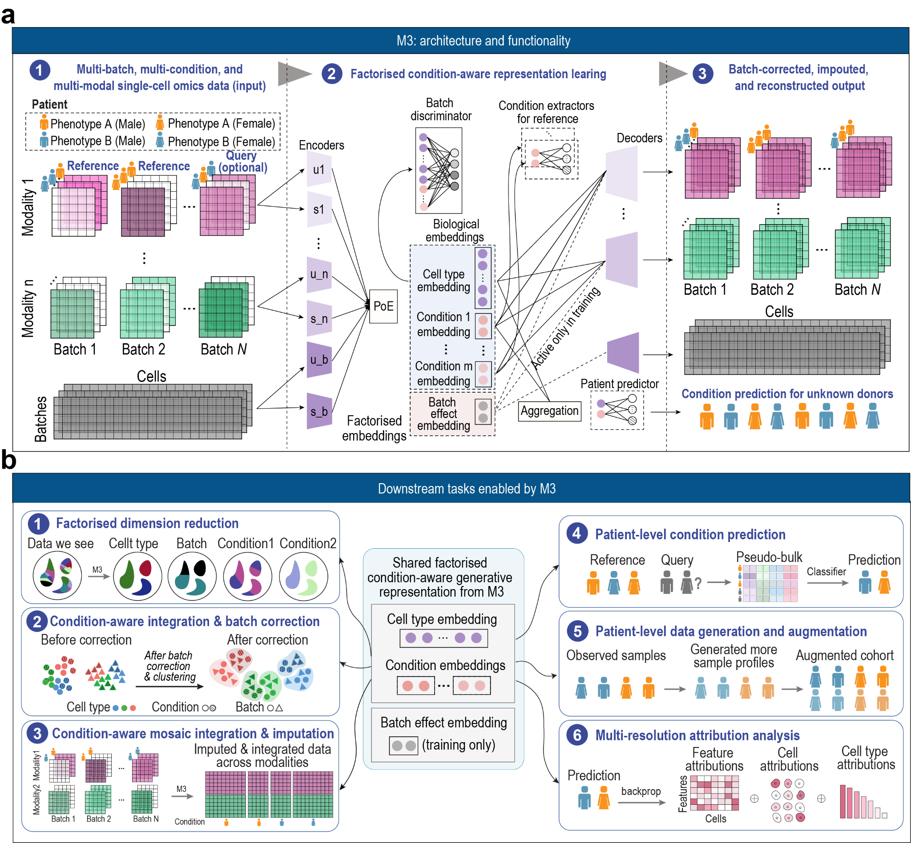

# How M3 works

**M3** is a deep generative framework for **condition-aware** integration,
**patient-level inference**, and **multi-resolution interpretation** of multimodal
single-cell omics data across multiple biological conditions and samples.

{ loading=lazy }

*__(a)__ M3 takes multi-batch, multi-condition, multimodal single-cell data as input.
Per-modality encoders are fused by a **product-of-experts** into a shared biological
embedding per cell, and M3 learns **factorised** embeddings that separate cell-type,
condition, and batch-effect variation. A batch discriminator (applied adversarially)
makes the biological embedding batch-invariant while condition extractors preserve
condition-dependent signal; decoders reconstruct batch-corrected, imputed output, and a
patient predictor aggregates cells into per-donor pseudo-bulk to infer the condition of
unknown donors. __(b)__ Because every result is decoded from the **same shared,
condition-aware representation**, the six downstream tasks stay internally consistent.*

## The model

M3 is built on a variational autoencoder (VAE). For each modality, a
modality-specific encoder maps molecular features into a latent representation,
and these are fused through a **product-of-experts (PoE)** into one shared
biological embedding per cell — which lets M3 handle both fully observed and
**mosaic** designs (where some samples are profiled with only a subset of
modalities).

Crucially, M3 learns *factorised* embeddings that separate sources of variation
explicitly: a **biological** factor (cell type), one **condition** factor per
declared condition, and a **batch** factor. During training all factors — including
the batch factor — are passed to the decoders, so reconstruction can account for
batch-specific technical effects while optimising. A batch discriminator pushes the
biological embedding to be batch-invariant, while condition extractors preserve
condition-dependent biology, so batch correction does not overcorrect the signal you
actually care about. At inference the batch factor is excluded, and because every
downstream result is decoded from this single shared, condition-aware representation,
M3 stays internally consistent across tasks instead of bolting separate task-specific
models together.

## The six tasks

The package exposes these capabilities through one [`m3.M3`](api-python.md#m3m3) object:

| # | Task | What you get | API |
|---|---|---|---|
| 1 | **Factorised dimension reduction** | condition-aware cell embeddings for clustering / UMAP | [`embedding`](api-python.md#m3embedding) |
| 2 | **Condition-aware batch correction** | batch-corrected, condition-preserving matrices | [`reconstruct`](api-python.md#m3reconstruct) |
| 3 | **Mosaic integration & imputation** | one embedding across samples that are missing a modality | [`concat`](api-python.md#m3concat) + [`reconstruct`](api-python.md#m3reconstruct) |
| 4 | **Patient-level condition inference** | per-donor condition prediction on held-out samples | [`predict_donors`](api-python.md#m3predict_donors) |
| 5 | **Patient-level sample generation** | synthetic donors / cells to augment small studies | [`augment`](api-python.md#m3augment), [`generate`](api-python.md#m3generate) |
| 6 | **Multi-resolution attribution** | a condition attributed back to genes, cells, and cell types | [`attribute`](api-python.md#m3attribute) |

## When to use M3

Reach for M3 when you have **multimodal, multi-condition, or multi-sample** data
and want to:

- **Integrate** across batches, conditions, and modalities while preserving
  condition signal, and **impute** missing modalities in mosaic designs.
- **Reconstruct** batch-corrected matrices for reproducible differential expression.
- **Infer at the patient level**, aggregating cell embeddings into pseudo-bulk
  profiles to predict a sample's condition (for example, disease status) on
  unseen query samples.
- **Generate** synthetic patient profiles to augment small studies.
- **Interpret** at multiple resolutions, attributing a condition back to genes,
  individual cells, and cell types.

## How M3 is trained

Training is handled inside [`M3.train`](api-python.md#m3train):

1. **Integration VAE.** Learns the factorised cell embedding. When a sample is
   held out at construction (`held_out=[...]` for a whole batch, or
   `held_out_samples=[...]` for specific donors, passed to `m3.M3(...)`), its
   condition labels are masked during training so they cannot leak into the
   representation.
2. **Donor predictor (optional).** An adversarial corrector aggregates cells into
   per-donor pseudo-bulk vectors, removes residual batch structure, and predicts
   the donor's condition. It trains automatically whenever both `donor_key` and
   `celltype_key` are supplied, and underpins
   [`predict_donors`](api-python.md#m3predict_donors) and
   [`attribute`](api-python.md#m3attribute).

## Get going

- **Install** — `pip install torch`, then install M3 from GitHub (see
  [setup details](installation.md)); imported as `import m3`.
- **First run** — the [Quickstart](quickstart.md), end to end on the built-in
  demo dataset.
- **Tutorials** — [Representation learning](notebooks/py_01_representation_learning.ipynb),
  [Patient prediction](notebooks/py_02_patient_prediction.ipynb),
  [Feature attribution](notebooks/py_03_attribution.ipynb),
  [Data augmentation](notebooks/py_04_augmentation.ipynb).
- **API** — the [`m3` reference](api-python.md).
